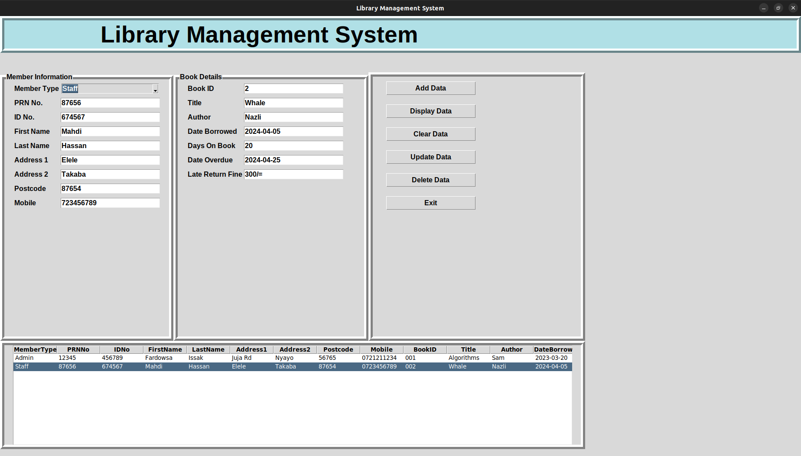

# Library Management System

The Library Management System is a simple and intuitive application built using Python and Tkinter for managing a library's book inventory. It allows users to add, update, delete, and view books in the library database.

## Features

- Add new books to the library.
- Update details of existing books.
- Delete books from the library.
- View the list of all books in the library.

## Technologies Used

- Python
- Tkinter (for the graphical user interface)
- SQLite (for the database)

## Installation

To run this project locally, follow these steps:

1. **Clone the repository:**

    ```bash
    git clone https://github.com/fardowsa1234/library-management-system.git
    cd library-management-system
    ```

2. **Create a virtual environment and activate it (optional but recommended):**

    ```bash
    python -m venv venv
    # On Windows
    venv\Scripts\activate
    # On macOS/Linux
    source venv/bin/activate
    ```

3. **Install the required packages:**

    ```bash
    pip install tkinter
    ```

4. **Run the application:**

    ```bash
    python main.py
    ```

## Usage

1. **Add a Book:**
   - Enter the Book ID, Title, Author, and Year in the respective fields.
   - Click on the "Add Book" button to add the book to the database.

2. **View Books:**
   - Click on the "View Books" button to see a list of all books in the library.

3. **Update a Book:**
   - Enter the Book ID of the book you want to update.
   - Enter the new Title, Author, and Year.
   - Click on the "Update Book" button to update the book details.

4. **Delete a Book:**
   - Enter the Book ID of the book you want to delete.
   - Click on the "Delete Book" button to remove the book from the database.

## Screenshots



## Contributing

Contributions are welcome! Please feel free to submit a Pull Request.

## License

This project is licensed under the MIT License - see the [LICENSE](LICENSE) file for details.

## Acknowledgements

- The Tkinter library for providing an easy way to create graphical user interfaces in Python.
- SQLite for the lightweight database.

